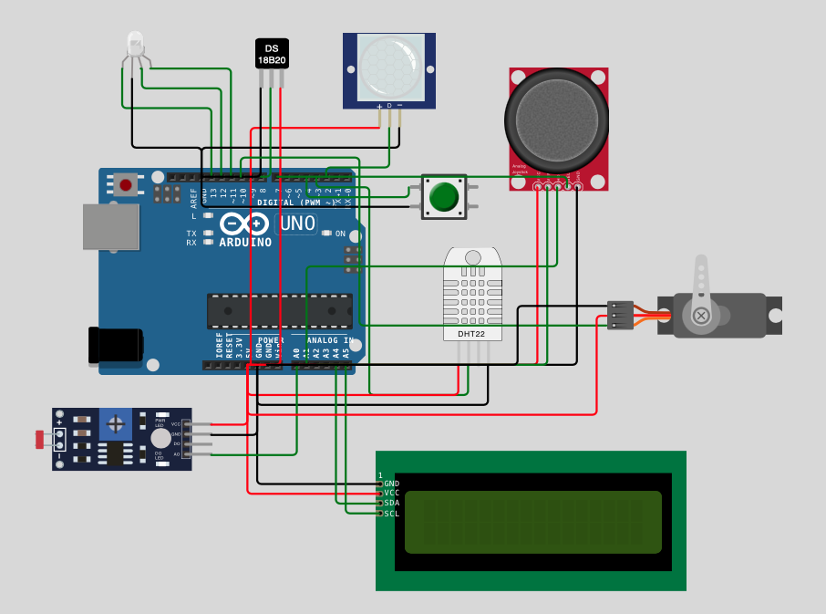
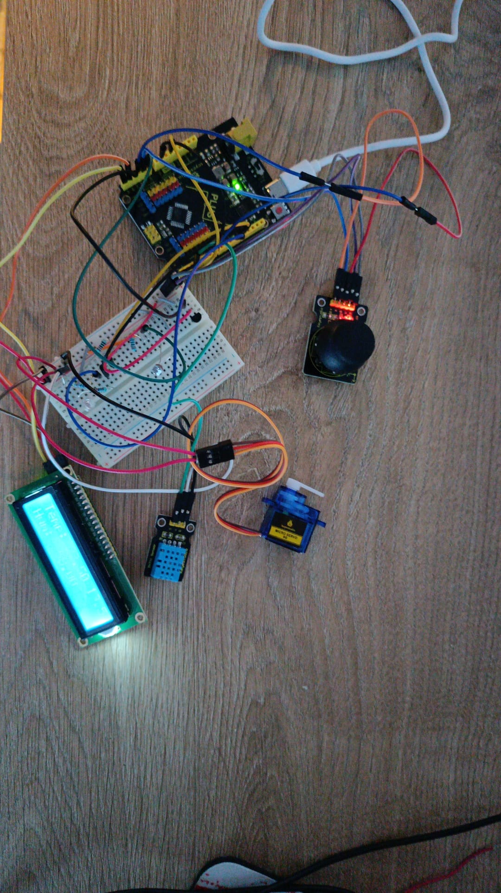

# Actividad_2_Equipos_e_Instrumentacion
Actividad 2 de la asignatura de Equipos e Instrumentación del master de Ingeniería de Telecomunicación de la UNIR. Esta actividad esta realizada por:

- Francisco Javier Hernántes Luaces
- Javier Lluch Sanz
- Marta Garcia Benzal
- Jesús Fernández Funcia

## Hardware
### Diagrama de conexiones
En la imagen inferior se puede observar el diagrama de conexiones de esta práctica.

### BOM
### Fotografía del circuito
En la fotografía inferior se puede observar la reconstrucción del sistema para regular la temperatura.

## Firmware
### Código comentado
En la carpeta [code](code "codigo") se encuentra el archivo .ino con el código comentado que se ha empleado para desarrollar esta práctica.

## Pruebas de Validación
### Simulación de wokwi
Si se pincha en este [enlace](https://wokwi.com/projects/399113513141451777 "wokwi") se dirigirá la simulación del circuito en la plataforma Wokwi.
### Pruebas con el circuito
